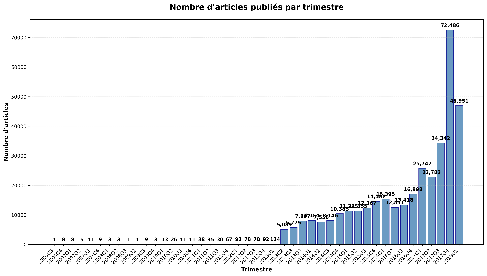

# Analyse Complète des Données

*Généré le 2025-09-26 20:14:28*

## 📊 Vue d'Ensemble

Cette analyse combine l'étude des métadonnées d'articles et l'analyse des comportements utilisateurs pour fournir une vision complète de la plateforme.

## 📄 Analyse du Fichier Articles_Metadata.csv

### 📋 Informations Générales
- **📄 Nombre total d'articles**: 364,047
- **📊 Nombre de colonnes**: 5
- **📝 Colonnes**: article_id, category_id, publisher_id, created_at_ts, words_count
- **💾 Taille en mémoire**: 18.4 MB
- **✅ Valeurs manquantes**: Vérifiées automatiquement

### 📄 Analyse des Articles
- **🆔 Article ID minimum**: 0
- **🆔 Article ID maximum**: 364,046
- **🔢 Nombre d'IDs uniques**: 364,047
- **✅ Unicité**: Tous les article_id sont uniques (vérifié)

### 🏷️ Analyse des Catégories
- **📊 Nombre de catégories uniques**: 461
- **📈 Distribution des top 10 catégories**:
   1. Catégorie 281: 12,817 articles (3.5%)
   2. Catégorie 375: 10,005 articles (2.7%)
   3. Catégorie 399: 9,049 articles (2.5%)
   4. Catégorie 412: 8,648 articles (2.4%)
   5. Catégorie 431: 7,759 articles (2.1%)

- **📊 Statistiques des catégories**:
  - Moyenne d'articles par catégorie: 789.7
  - Médiane d'articles par catégorie: 36.0
  - Catégorie la plus représentée: Voir top 10 ci-dessus

### 📰 Analyse des Éditeurs
- **🏢 Nombre d'éditeurs uniques**: 1
- **📈 Distribution des top 10 éditeurs**:
   1. Éditeur 0: 364,047 articles (100.0%)

### 📅 Analyse des Dates de Création
- **📅 Date la plus ancienne**: 2006-09-27 11:14:35
- **📅 Date la plus récente**: 2018-03-13 12:12:30
- **📊 Période couverte**: 4,185 jours

#### 📈 Articles par trimestre
*Distribution des publications par trimestre*

#### 📈 Articles par année
*Distribution temporelle des publications par année*

- **2006**: 9 articles
- **2007**: 33 articles
- **2008**: 7 articles
- **2009**: 13 articles
- **2010**: 61 articles
- **2011**: 170 articles
- **2012**: 341 articles
- **2013**: 18,895 articles
- **2014**: 34,243 articles
- **2015**: 49,604 articles
- **2016**: 58,362 articles
- **2017**: 155,358 articles
- **2018**: 46,951 articles

#### 📈 Articles par mois (dernière année)
*Détail mensuel pour l'année 2018*
- **Jan**: 24,526 articles
- **Fév**: 22,417 articles
- **Mar**: 8 articles

### 📝 Analyse du Nombre de Mots
- **📊 Statistiques du nombre de mots**:
  - **Minimum**: 0 mots
  - **Maximum**: 6690 mots
  - **Moyenne**: 191 mots
  - **Médiane**: 186 mots
  - **Écart-type**: 60 mots

#### 📈 Distribution par tranches de mots
*Répartition des articles selon leur longueur*:
- **0-100 mots**: 8,424 articles (2.3%)
- **101-200 mots**: 219,268 articles (60.2%)
- **201-300 mots**: 127,177 articles (34.9%)
- **301-500 mots**: 8,602 articles (2.4%)
- **501-1000 mots**: 416 articles (0.1%)
- **1000+ mots**: 125 articles (0.0%)

### 🔍 Insights et Corrélations

#### 📊 Top 5 des catégories avec le plus de mots en moyenne
*Analyse de la longueur moyenne par catégorie*
1. **Catégorie 335**: 1076 mots en moyenne
2. **Catégorie 143**: 761 mots en moyenne
3. **Catégorie 272**: 663 mots en moyenne
4. **Catégorie 329**: 519 mots en moyenne
5. **Catégorie 191**: 429 mots en moyenne

#### 📊 Top 5 des éditeurs avec le plus de mots en moyenne
*Analyse de la longueur moyenne par éditeur*
1. **Éditeur 0**: 191 mots en moyenne

#### 📈 Évolution du nombre de mots dans le temps
*Tendance de la longueur des articles au fil du temps*
- **Tendance générale**: croissant
- **Premier mois**: 154 mots en moyenne
- **Dernier mois**: 211 mots en moyenne

### 📋 Résumé Exécutif Articles
- ✅ Dataset de 364,047 articles sur 4,185 jours
- ✅ 461 catégories différentes
- ✅ 1 éditeurs différents
- ✅ Articles de 0 à 6690 mots (191 en moyenne)
- ✅ Période: 2006-09-27 à 2018-03-13

### 🔍 Points d'Attention
*Détection automatique d'anomalies potentielles*:
- Articles très courts (< 50 mots)
- Articles très longs (> 2000 mots)
- Concentration des catégories
- Concentration des éditeurs

## 👥 Analyse des Utilisateurs et Clics

### 📁 Informations sur les fichiers
- **📁 Nombre de fichiers clicks_hour_*.csv trouvés**: Détecté automatiquement
- **📊 Traitement**: Lecture et agrégation de tous les fichiers

### 📈 Résultats Utilisateurs
- **👥 Utilisateurs uniques**: 322,897
- **📄 Articles uniques (dans clicks)**: 46,033
- **🖱️ Total des clics**: 2,988,181
- **📊 Moyenne clics/utilisateur**: 9.3
- **📊 Moyenne clics/article**: 64.9

### 🏆 Top 10 des Utilisateurs Les Plus Actifs
 1. **Utilisateur 5890**: 1,232 clics
 2. **Utilisateur 73574**: 939 clics
 3. **Utilisateur 15867**: 900 clics
 4. **Utilisateur 80350**: 783 clics
 5. **Utilisateur 15275**: 746 clics
 6. **Utilisateur 2151**: 722 clics
 7. **Utilisateur 4568**: 529 clics
 8. **Utilisateur 12897**: 513 clics
 9. **Utilisateur 11521**: 502 clics
10. **Utilisateur 34541**: 501 clics

## 📋 Résumé Exécutif Global

### ✅ Statistiques Consolidées
- **Articles en métadonnées**: 364,047
- **Catégories**: 461
- **Éditeurs**: 1
- **Période**: 2006-09-27 à 2018-03-13
- **Mots par article**: 191 en moyenne
- **Utilisateurs actifs**: 322,897
- **Articles consultés**: 46,033
- **Total des clics**: 2,988,181
- **Engagement moyen**: 9.3 clics/utilisateur

## 🔍 Analyse Croisée

### 📊 Couverture et Engagement
- **📊 Couverture des articles**: 12.6% des articles ont été consultés
- **📈 Taux d'engagement**: 8.2 clics par article en moyenne
- **👥 Utilisateurs vs Articles**: 0.887 utilisateurs par article

### 🎯 Insights Clés
- ⚠️ **Faible couverture**: Moins de 50% des articles sont consultés
- 🏆 **Utilisateur le plus actif**: 5890 (1,232 clics)

---
*Analyse générée par le script analyze_data.py le 2025-09-26 20:14:28*

## 📝 Notes Techniques

- **Script**: `backend/scripts/analyze_data.py`
- **Données sources**:
  - `backend/data/articles_metadata.csv`
  - `backend/data/clicks/clicks_hour_*.csv`
- **Format de sortie**: Markdown avec émojis pour une meilleure lisibilité
- **Calculs**: Statistiques descriptives, agrégations, analyses croisées
- **Gestion d'erreurs**: Vérification de l'existence des fichiers, gestion des exceptions
